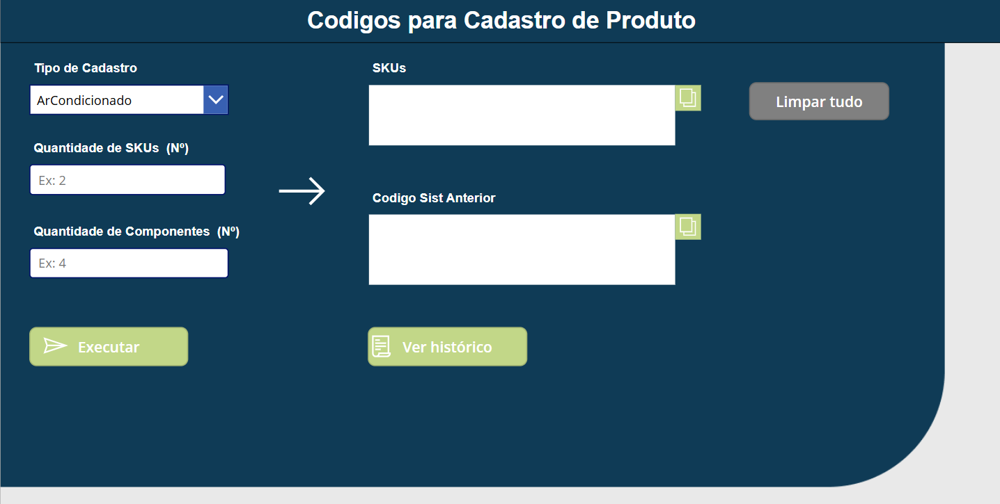

# 🔧 SKU Sequence Automator — Power Platform

> Automação de geração e sequenciamento de códigos SKU usando Power Apps, Power Automate e SharePoint.

---

## 📋 Sobre o Projeto

Sistema low-code desenvolvido para eliminar a geração manual de códigos SKU em empresas com alto volume de cadastro de produtos. O processo anterior era suscetível a duplicidade, falhas de auditoria e lentidão operacional.

A solução transforma um fluxo manual em um **motor de sequência inteligente**, garantindo unicidade, rastreabilidade e escalabilidade.


---

## 🏗️ Arquitetura

```
[Power Apps]  →  [Power Automate]  →  [SharePoint]
   UI               Lógica            Dados
```

### Componentes

| Camada | Ferramenta | Responsabilidade |
|---|---|---|
| Interface | Power Apps | Coleta de dados do usuário |
| Lógica | Power Automate | Orquestração do fluxo e cálculo de sequência |
| Dados | SharePoint Lists | Lista mestre de sequências + Histórico de auditoria |

---

## ⚙️ Como Funciona

1. **Entrada (Power Apps)**
   - Usuário preenche tipo do produto, status de importação e quantidade desejada
   - Dispara o fluxo via conector do Power Automate

2. **Processamento (Power Automate)**
   - Consulta a lista mestre de sequências no SharePoint
   - **Bloqueio de concorrência**: trava o registro durante a operação para evitar que dois usuários obtenham o mesmo número simultaneamente
   - Calcula o próximo número disponível com base no último registro + quantidade solicitada
   - Atualiza a lista mestre de forma atômica
   - Libera o registro para o próximo uso

3. **Auditoria (SharePoint)**
   - Registra automaticamente: usuário responsável, data/hora (fuso horário local), e todos os códigos gerados

4. **Resposta (Power Apps)**
   - Os códigos gerados são retornados em tempo real e exibidos ao usuário

---

## 🧩 Desafios Técnicos

### Controle de Concorrência
Implementação de bloqueio otimista na lista do SharePoint para garantir que operações simultâneas não gerem códigos duplicados.

### Tratamento de Dados
Expressões para lidar com:
- Valores nulos em campos opcionais
- Conversão de tipos texto ↔ número
- Join de sequências para exibição legível

### Fuso Horário
O Power Automate opera em UTC por padrão. Foi necessário aplicar conversão para o horário local (UTC-3) nos registros de auditoria, garantindo rastreabilidade precisa.

### Mapeamento de IDs
Resolução do problema de referência cruzada entre listas do SharePoint, assegurando que as atualizações sempre ocorram na linha correta.

---

## ✅ Resultados

- **Zero duplicidade** de códigos SKU após a implementação
- **Auditoria completa**: quem gerou, quando e quais códigos
- **Escalável**: suporta geração em lote de qualquer tamanho
- **Sem dependência de TI**: qualquer usuário autorizado opera o sistema

---

## 🛠️ Stack

- Microsoft Power Apps (Canvas App)
- Microsoft Power Automate (Cloud Flow)
- Microsoft SharePoint Online (Lists)
- Microsoft 365

---

## 📌 Aprendizados

Este projeto é um exemplo de que **Low-Code não significa Low-Quality**. Com a arquitetura correta é possível construir sistemas resilientes, seguros e auditáveis sem escrever código tradicional.

Conceitos aplicados:
- Atomicidade em operações de leitura/escrita
- Controle de concorrência em ambientes multiusuário
- Separação entre camadas de apresentação, lógica e dados
- Design orientado à auditoria

---

## 📄 Licença

Este repositório documenta a arquitetura e os aprendizados do projeto. Nenhum dado sensível ou código proprietário está incluído.
